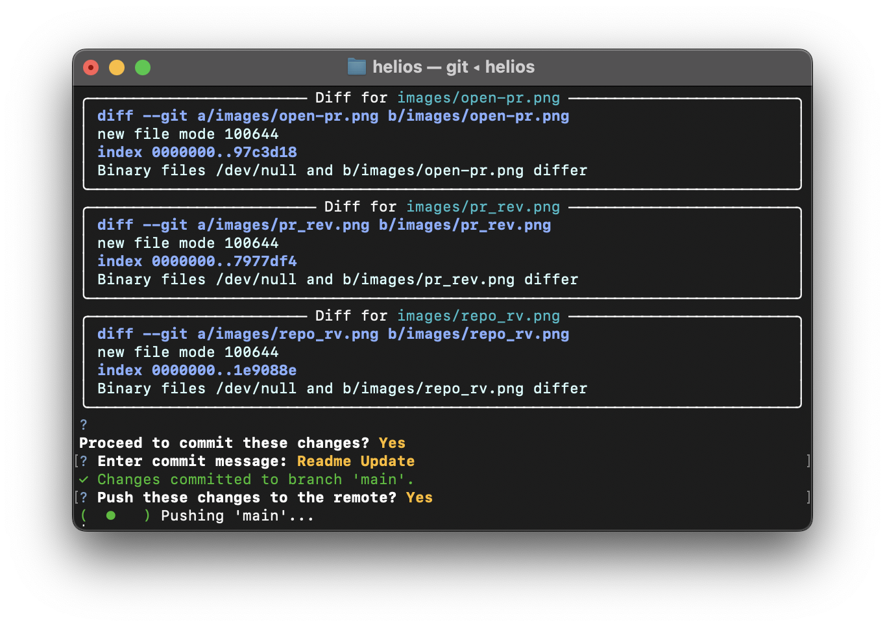

# Helios

###### Written by Helios

A command-line AI assistant for software engineering tasks with code generation, git integration, and repository management capabilities.

## Table of Contents
- [Features](#features)
- [Usage](#usage)
- [Configuration](#configuration)
- [Demo](#demo)

## Features

The AI Code Assistant provides the following core functionalities:

- Code generation and modification with context-awareness
- Git integration 
- File management commands
- Repository indexing and refresh
- GitHub API interactions
- Project structure creation and validation
- AI PR reviews
- AI Repository summaries

## Usage

> Prerequisites: Python, Ollama

### Run Helios

```bash
# Clone repo
git clone https://github.com/viditvidit/helios.git

# Run in development mode
pip install -e .

# Run this to use Helios
helios
```

### Create a `.env` file
```env
GITHUB_TOKEN = <YOUR GIT TOKEN>
GITHUB_USERNAME = <YOUR GIT USERNAME>

OLLAMA_HOST = http://localhost:11434 # or your custom host link
```

### Change or Add your model of choice
Make changes in: [models.yaml](configs/models.yaml)
```yaml
# Change here
models: 
  gemma3: # Set custom name
    name: 'gemma3:27b-it-q4_K_M' # Enter model name as seen in ollama
    <<: *common_settings
```


### Know all features:
```bash
/help # For exploring all features of Helios
```

### Agent Prompt Example

```bash
/knight create a .NET console application named 'dotnet-weather-cli'. The app should take a city name as a command-line argument, make a GET request to a public weather API (like Open-Meteo), and print the current temperature for that city. Use the `HttpClient` class for the API call and `Newtonsoft.Json` to parse the response.
```

## Configuration

Modify configuration settings in `configs/models.yaml` to customize:

- AI model parameters
- Agent instructions and principles
- Code generation guidelines
- Project structure templates

## Demo

### Landing:


### File Creation


### File mentions


### GitHub Features:

**Smart Review**



**Open PRs**


### Knight Agent
**Agent prompt and plan**


**Execution**


**Git Push**


Other Git creations:


### AI Features:

**PR Review**

**Repo Summary**

