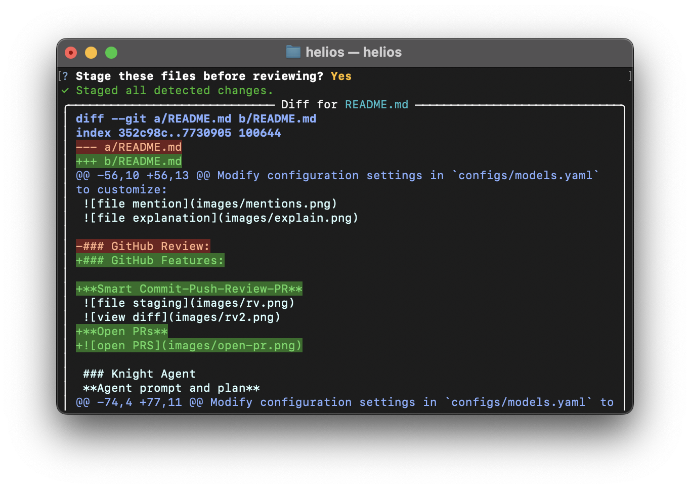

# Helios

###### Written by Helios

A command-line AI assistant for software engineering tasks with code generation, git integration, and repository management capabilities.

## Table of Contents
- [Features](#features)
- [Usage](#usage)
- [Configuration](#configuration)
- [Demo](#demo)

## Features

The AI Code Assistant provides the following core functionalities:

- Code generation and modification with context-awareness
- Git integration 
- File management commands
- Repository indexing and refresh
- GitHub API interactions
- Project structure creation and validation
- AI PR reviews
- AI Repository summaries

## Usage

### Agent Prompt Example

```bash
/knight create a .NET console application named 'dotnet-weather-cli'. The app should take a city name as a command-line argument, make a GET request to a public weather API (like Open-Meteo), and print the current temperature for that city. Use the `HttpClient` class for the API call and `Newtonsoft.Json` to parse the response.
```
```bash
/help # for exploring all features of Helios
```

## Configuration

Modify configuration settings in `configs/models.yaml` to customize:

- AI model parameters
- Agent instructions and principles
- Code generation guidelines
- Project structure templates

## Demo

### Landing:


### File Creation


### File mentions


### GitHub Features:

**Smart Commit-Push-Review-PR**


**Open PRs**


### Knight Agent
**Agent prompt and plan**


**Execution**


**Git Push**


Other Git creations:


### AI Features:

**PR Review**

**Repo Summary**

